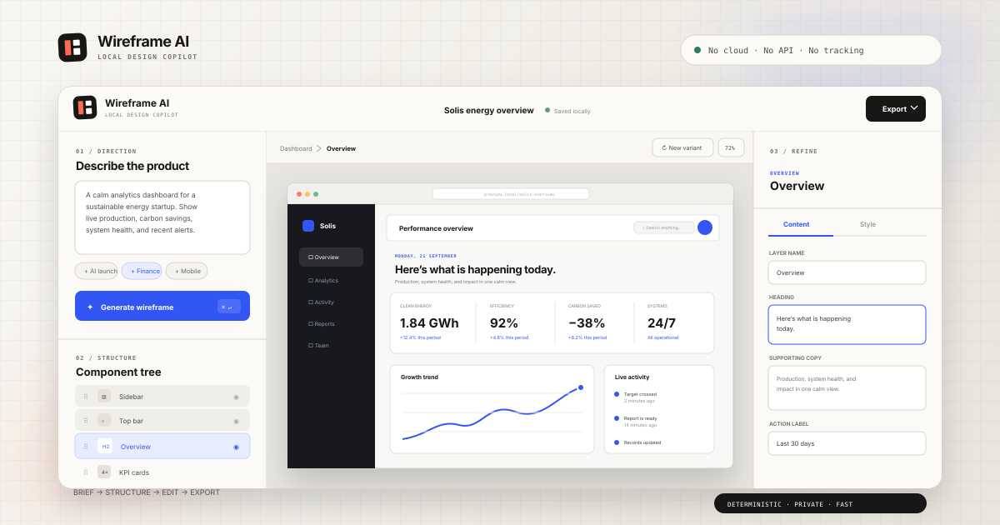
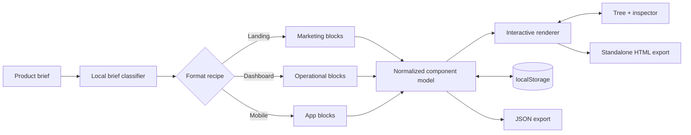

<div align="center">
  

  <h1>Wireframe AI</h1>
  <p><strong>A private, local-first UI copilot that turns product briefs into editable wireframes.</strong></p>

  <p>
    
    
    
    
  </p>
</div>

> [!IMPORTANT]
> Wireframe AI is an honest design-rules prototype. It does **not** call an LLM or any remote AI service. Its “AI” experience comes from transparent, deterministic brief classification, content heuristics, and format-aware layout recipes that run entirely in your browser.

## The idea

The blank canvas is rarely the real starting point. Product teams usually already have goals, audience clues, desired outcomes, and a rough mental model—but translating that context into a useful first structure still takes time.

Wireframe AI compresses that first pass. Describe a product in natural language, choose a format, and receive a polished, editable structure in seconds. The result is deliberately a **thinking tool**, not a finished-product generator: every block can be selected, rewritten, reordered, hidden, duplicated, restyled, or exported.

## What it can do

- Generate distinct **dashboard**, **landing page**, and **mobile app** wireframes from a product brief.
- Infer useful product language for energy, finance, wellness, logistics, AI, and general product contexts.
- Edit every block through a component tree and contextual inspector.
- Drag layers to reorder them; duplicate, hide, move, or remove individual sections.
- Tune alignment, emphasis, vertical density, palette, device, and zoom.
- Generate deterministic layout variants without network requests.
- Persist the complete project to `localStorage` automatically.
- Export a portable project JSON file or a standalone HTML prototype.
- Work across desktop, tablet, and mobile layouts with keyboard-accessible controls.

## Architecture



There is no server, build chain, framework, analytics endpoint, or hidden model call. `app.js` owns a small normalized component model; rendering functions convert that model into format-specific HTML; the inspector writes changes back to the same state.

## Quick start

Clone or download this folder and open `index.html` directly:

```bash
open index.html
```

For a local URL (recommended when testing browser downloads):

```bash
python3 -m http.server 8080
# Visit http://localhost:8080
```

No package install or build step is required.

## Usage

1. Write a product brief, or choose one of the suggestion chips.
2. Pick **Landing**, **Dashboard**, or **Mobile**.
3. Select **Generate wireframe** (or press <kbd>⌘</kbd>/<kbd>Ctrl</kbd> + <kbd>Enter</kbd>).
4. Select any block on the canvas or in the component tree.
5. Edit its copy under **Content**, then adjust presentation under **Style**.
6. Try **New variant**, switch device sizes, or reorder layers via drag and drop.
7. Export a self-contained HTML prototype or project JSON from the top-right menu.

Projects are saved after every meaningful edit. <kbd>⌘</kbd>/<kbd>Ctrl</kbd> + <kbd>S</kbd> also forces a local save confirmation.

## Project structure

```text
09-wireframe-ai/
├── assets/
│   └── cover.svg      # Repository hero artwork
├── index.html         # Accessible application shell
├── styles.css         # Product UI + all wireframe themes
├── app.js             # State, generation, editing, persistence, exports
├── README.md
├── LICENSE
└── .gitignore
```

## Design decisions

**A tool should look like a tool.** The product chrome uses a warm drafting-paper surface, thin technical rules, tiny mono labels, and a precise three-column workspace. The generated work remains visually separate inside a browser-like artboard.

**Structure before decoration.** Three format recipes encode useful information hierarchy rather than returning arbitrary boxes. A dashboard emphasizes signals and records; a landing page builds narrative and proof; a mobile concept prioritizes glanceable summaries and thumb-friendly actions.

**One state model.** Canvas, tree, and inspector are projections of the same component array. This keeps edits predictable and makes the exported JSON genuinely useful.

**Determinism is a feature.** The same brief, format, and variant always produce the same content strategy. That makes the prototype fast, inspectable, offline-capable, and easy to extend.

## Privacy and local-first behavior

- Briefs and projects never leave the browser.
- The app makes no API or telemetry calls.
- State is stored only in the current origin’s `localStorage`.
- Export happens through in-browser `Blob` downloads.
- Clearing browser site data removes the saved workspace.

## Roadmap

- [ ] Import previously exported `.wireframe.json` projects.
- [ ] Add undo/redo history and named local versions.
- [ ] Support custom design tokens and typography scales.
- [ ] Add keyboard-based tree reordering.
- [ ] Generate shareable image/PDF previews entirely in-browser.
- [ ] Offer an optional, explicitly configured LLM adapter—never enabled by default.

## Contributing

Small, focused improvements are welcome. Keep the zero-dependency, local-first constraint intact unless a proposal clearly explains the trade-off.

1. Create a feature branch.
2. Make the smallest coherent change.
3. Test all three formats at desktop and mobile widths.
4. Confirm local persistence and both exports still work.
5. Open a pull request describing the user-facing outcome.

If adding a new block, define its library metadata, default content, renderer, and responsive styles together so the component remains fully editable.

## License

MIT © 2026. See [LICENSE](LICENSE).

## Built to be inspected

[](https://github.com/harshareddy0405/wireframe-ai/actions/workflows/ci.yml)

The project includes versioned source, guarded local persistence, malformed-data recovery, product-specific interaction tests, and automated accessibility semantics checks. No API key is required to explore it.

```bash
# Optional development checks; the app itself needs no installation
npm ci --ignore-scripts
npm run check
npm test
npm run format:check
```

[Engineering notes](docs/ENGINEERING.md) · [Contributing](CONTRIBUTING.md) · [Security & privacy](SECURITY.md)

**Scope:** Generation uses deterministic templates, not an LLM. Exported mock data is illustrative and may need real content before production use.
